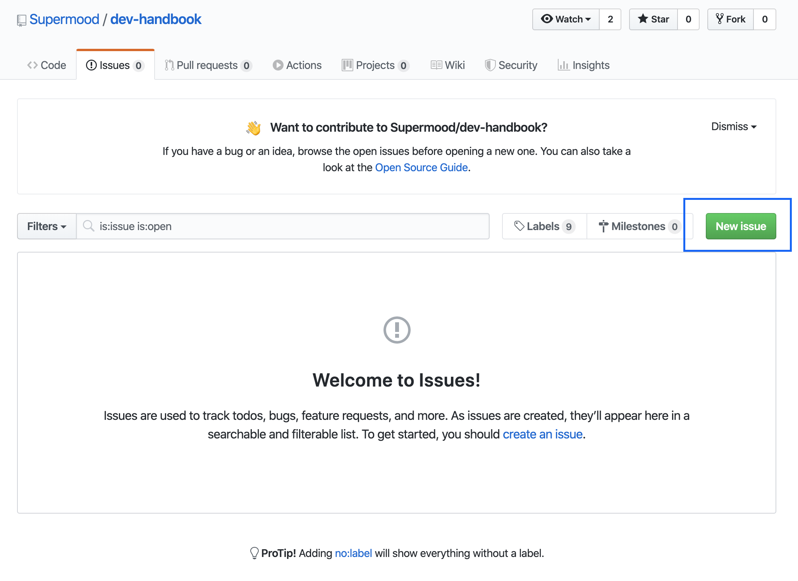
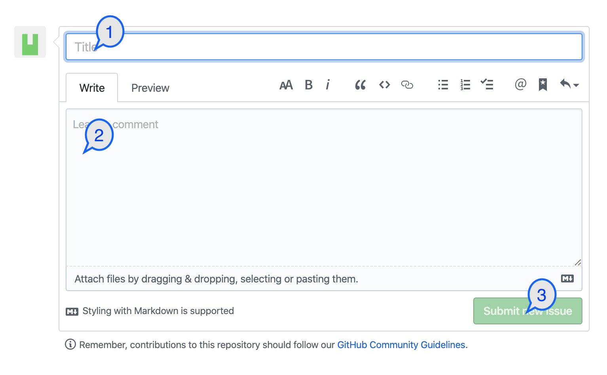
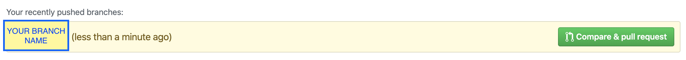
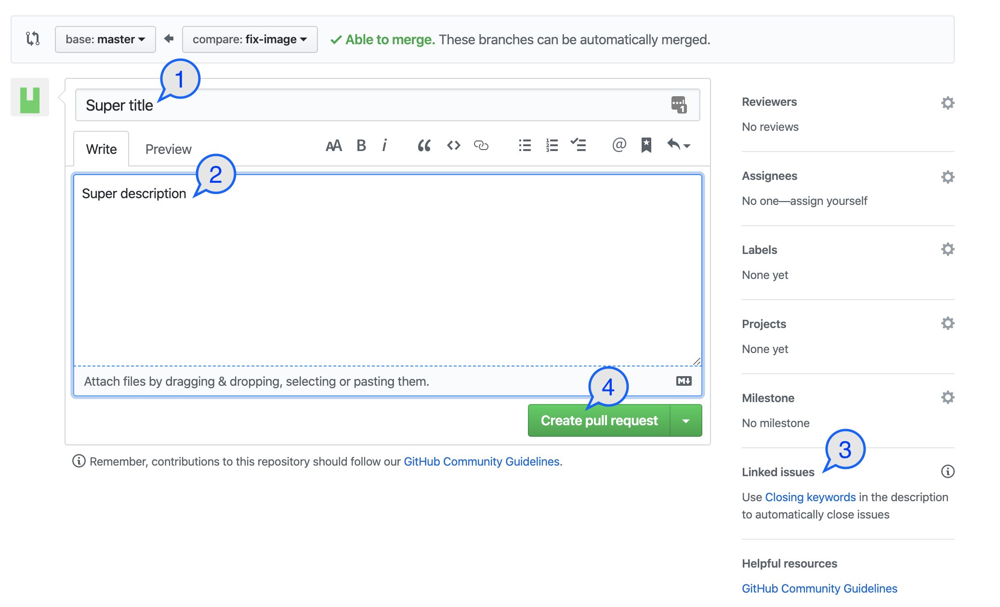

# Contributor

<< [Home](/README.md)

## Ask questions

To ask a question, it is necessary to open an issue with an explicit title of less than 80 characters and a description with as much information as possible. A notification with a new request will be sent to the team on the slack.

For start, open a issue.



Complete the form.

1. Add explicit title
2. Add description with as much information as possible
3. Apply form



## Suggest improvements or add clarifications.

To add information to the handbook, it is necessary to open a merge request with the difference between master and the new branch, create an issue with the same name as the merge request and link the two. All discussion will be done in issues. A notification with a new request will be sent to the team on the slack.

> If this change is linked to a question, linked directly to the issue without recreating another.

We start by creating a local branch, adding its code and pushing it to the repository.

```bash
git checkout -b <branch_name>
git add <files>
git commit -m "<Messages>"
git push --set-upstream origin <branch_name>
```

If an issue that deals with this subject (see Ask questions section) does not exist, then one must be created. Follow the steps above.

> All discussions are done in the issues and not in the pull request.

We open the repository [dev-handbook](https://github.com/Supermood/dev-handbook/pulls) in the __pull requests__ section and click on the __compare & pull request__ button which has the name of its branch.



Complete the form.

1. Add explicit title
2. Add description with as much information as possible
3. Link issue
4. Apply form



## Commit Message Guidelines

We define how to name and format our commits in order to have a clean **project history**, because it is more readable and because we use the commit messages to **generate our release log**.

### Commit Message Format

Each commit message has a **type** and a **subject**:

```
<type>: <subject>
```

Sample
```
docs: add commit message format guidelines to the contributing guide
```

### Type
Must be one of the following:

* **build**: Changes that affect the build system or external dependencies
* **ci**: Changes to our CI configuration files and scripts
* **docs**: Documentation only changes
* **feat**: A new feature
* **fix**: A bug fix
* **perf**: A code change that improves performance
* **refactor**: A code change that neither fixes a bug nor adds a feature
* **style**: Changes that do not affect the meaning of the code (white-space, formatting, etc)
* **test**: Adding missing tests or correcting existing tests
