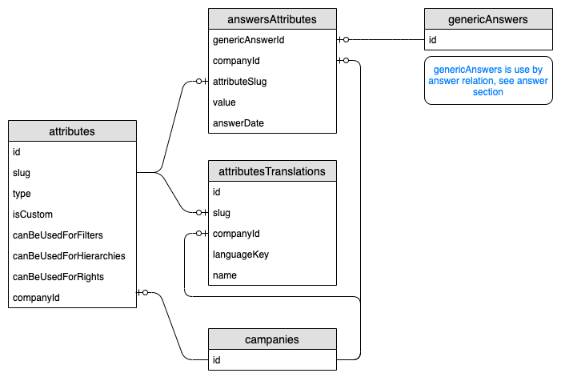

# Attribute

<< [Concept](/concept.md)

## Entity relation

The following tables are used:

- attributes
- attributesTranslations
- userAttributes
- answerAttributes
- genericAnswers
- answerPersonIds

