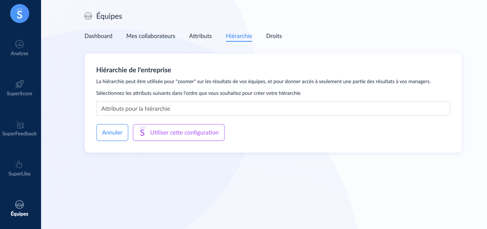
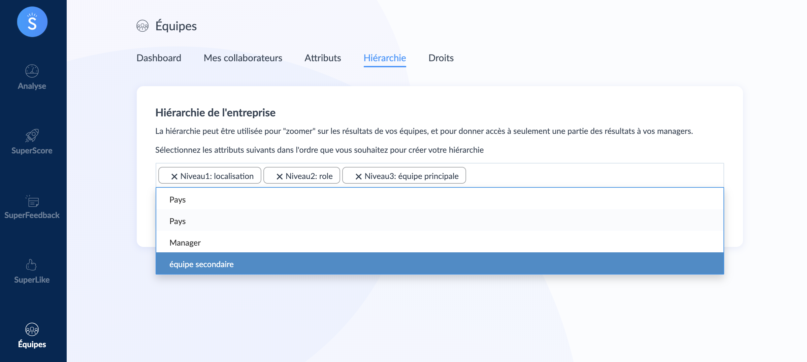
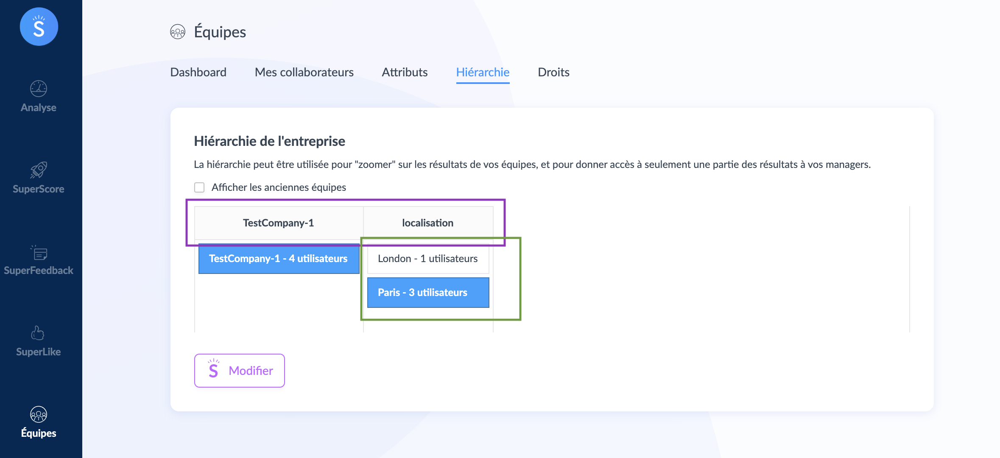
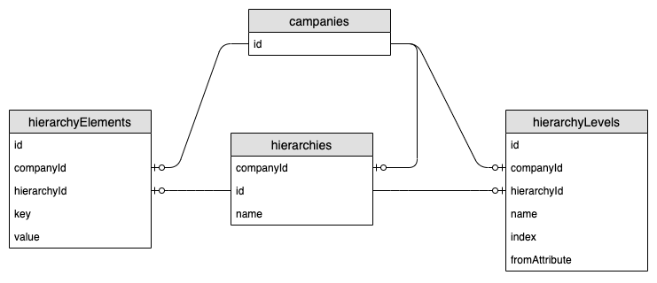

# Hierarchy

<< [Concept](/concept.md)

The hierarchy is a way to create population segments[^1] and then to be able to filter.

## Where is this used

- Permission data manager rights based on a population.
- Question a type of population.
- Have a report by type of population.

## The operation

Before going into operation, we will take a look at the side of the users because the creation of hierarchy is based on the attributes available in them.

Example user information

```json
{
    "name": "demoName",
    "office": "london",
    "role": "developer",
    "team": "Gryffondor"
}

{
    "name": "otherDemoName",
    "office": "Paris",
    "role": "Ops",
    "team": "Serpentard"
}
```

With this information we can create a hierarchy that has 3 levels of segmentation.

Example of population segment:


- I wish to have all the developers
- I wish to have all the developer who is in London.
- I wish to have all the developer who is in Paris who have the role Ops.
- I wish to have all the developer who is in Paris who has the role Ops and the Slytherin team.

> There is the `attributes` table which lists the attributes available for the company and a `userAttributes` table for saving user information.

### User interface

> Par defaut le premier niveau de la hierarchie est toujours la compagnie

We go to the supermood site with the role mooder[^2] and we click on the __modify__ button. This functionality is only available at CX[^3] peoples.


As to explain we see that the hierarchy has company in its first level. We are going to click on __Attributes pour la hierarchie__.



We add the segments we want.

- Localisation
- Role
- Equipe principale

> Attention the order is important

And we click on __Use this configuration__



Once the configuration is finished, we return to the hierarchy page and we can navigate through the segments. We find in the purple square the list of segments and in the green square the values. As a reminder, this value is all the information entered in the user. We can see below the representation in tree of the hierarchy.



## Technical

> before reading this section it is necessary to understand how the [attributes](/attribute.md) works.

### Entity relation

On the database side we have an entry in the table __hierarchies__ for each company, in the table __hierarchyLevels__ we find all the segments added in the _configuration part of the strategy_ and in the table __hierarchyElements__ we have all the possibilities contained in the values ​​of the users.

> When you fill in a hierarchy, you delete all the entries linked to the previous one and create the new one.



### Miscellaneous information

There is the key __key__ in the entries of the table __hierarchyElements__, it corresponds to a serialization of the position of this value within the hierarchy tree.

In the following shema we can see that the key __1x2x2x1__ corresponds to the developers who are in Paris in the Ravenclaw team with the role OPS.


[^1]: A set of user grouped by their attributes.
[^2]: The role mooder is granted to the person who works within supermood. [how to become](/role.md##Mooder)
[^3]: CX customer experience
